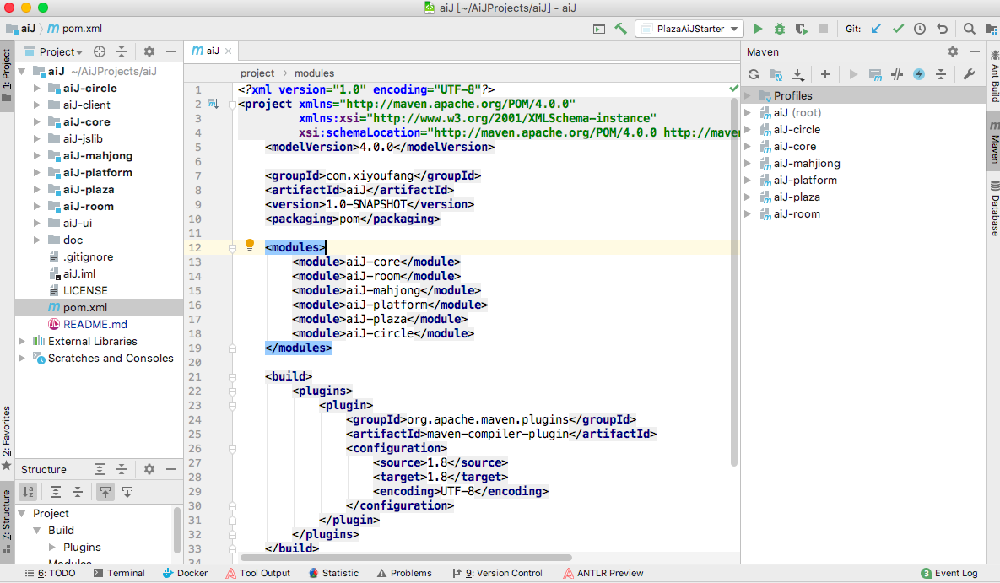
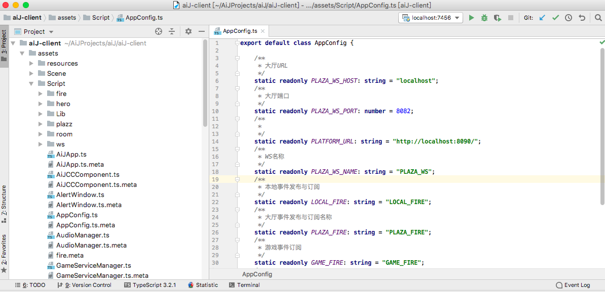
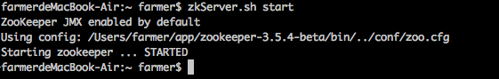
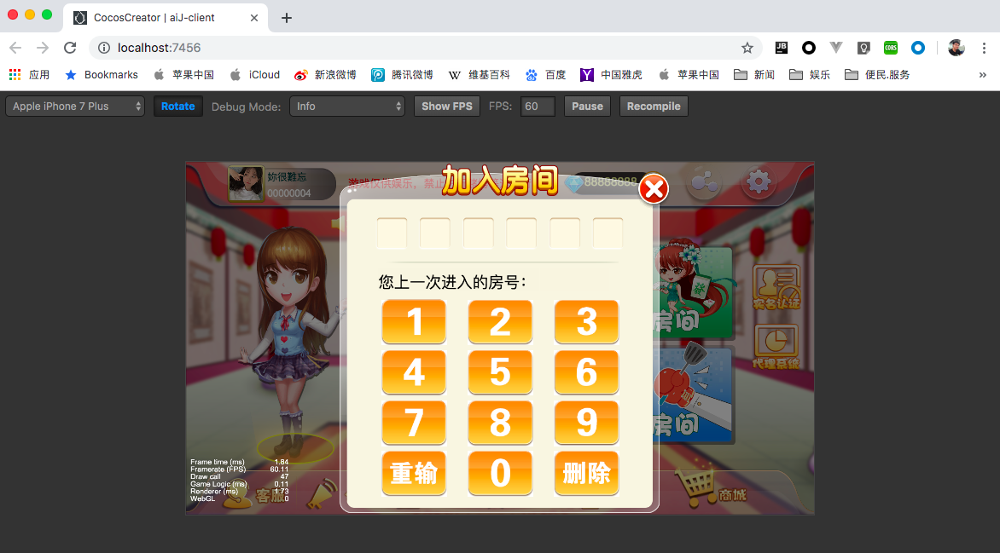

# AIJ文档

本文档主要描述如何快速配置该项目的开发环境，并且对项目结构进行了简单的描述性介绍。

## 相关工具与说明

| 名称 |  版本  | 用途 |链接  |
|------------|-------|-------|-------|
|  JDK  |    8  | 游戏服务器开发运行环境 |   https://www.oracle.com/technetwork/java/javase/downloads/index.html  |
|  Zookeeper  |   3.5.4  | 注册中心：用于注册游戏服务、大厅服务、平台服务 | https://archive.apache.org/dist/zookeeper/  |
|  mysql  |  5.7.26  | 数据库 | https://dev.mysql.com/downloads/mysql/5.7.html#downloads  |
|  CocosCreator  |  2.1.1  | 游戏引擎 | https://www.cocos.com/creator  |
|  FairyGui  | 3.10.4  | 游戏UI编辑器 | http://www.fairygui.com/product/  |
|  IntelliJ IDEA  | --  | 游戏服务器端开发工具 | https://www.jetbrains.com/  |
|  WebStorm  | --  | 游戏客户端开发工具 | https://www.jetbrains.com/  |
|  Node  | --  | 用于支持node_modules  | http://nodejs.cn/  |

可以使用Eclipse等Java IDE工具代替IntelliJ IDEA，可使用VSCode代替WebStorm。

本人更习惯于使用Jetbrains的工具所以使用的是 IntelliJ IDEA 与 WebStorm。

## 快速开始

### 下载源代码

```
git clone https://gitee.com/xiyoufang/aij.git
```

下载好代码后将使用各个工具间代码加载到工具中

使用IntelliJ IDEA 打开aij目录，将pom.xml文件加载到IDEA中



使用CocosCreator 打开aiJ-client目录

目前开发过程中只需将CocosCreator把项目打开，用于启动游戏的web服务，除了构建代码之外之后一般都用不上。


此时通过浏览器访问CocosCreator上显示的URL，可以看到如下效果

推荐使用Chrome浏览器用于调试


使用FairyGui 打开 aiJ-ui目录

FairyGui用于设计游戏的UI，与发布UI，其他情况一般也用不上


使用WebStorm 打开aiJ-client目录

客户端代码用WebStorm进行开发



### 子模块介绍

| 模块名称 | 用途 | 是否为可执行程序  |
|------------|-------|-------|
| aiJ-core  | 服务器核心模块，封装了网络、注册中心、数据库等公共模块 ，其他模块都基于此模块开发 | × |
| aiJ-room | 房间类游戏模块，封装了玩家管理、房间生命周期管理、服务监控、测试接口、机器人接口等模块，房间类子游戏依赖该模块进行开发 | × |
| aiJ-mahjong | 南丰麻将游戏，实现具体的游戏逻辑 | √ |
| aiJ-plaza | 游戏大厅，提供用户登录注册服务、获取游戏列表服务、游戏公告、客户端升级等服务 | √ |
| aiJ-platform | 运营管理系统，提供日常的运营支持 | √ |
| aiJ-circle | 俱乐部服务 | √ |
| aiJ-ui | 客户端UI | × |
| aiJ-client | 客户端程序 | √ |

子游戏与子游戏之间相互独立，同一个子游戏可以简单的通过部署多份来实现横向扩展，游戏大厅、运营管理系统等都可以通过部署多份来实现横向扩展.

### 数据库初始化

* 修改各个应用的 *_config.properties 文件的数据库相关配置，例如数据库类型、数据库用户名、密码
* 以mysql为例，修改用户名密码后，再手动创建对应的数据库aij-users、aij-platform、aij-room、aij-mahjong即可
* 启动程序，数据库表、初始化数据将会被自动初始化

#### 各个库介绍

| 数据库名称 | 说明  |
|-----------|------------|
| aij-users | 用户数据库，用户相关的信息，例如：基本信息、金币信息、钻石信息等 |
| aij-platform | 平台数据库，运营相关信息，例如：公告信息、配置信息、服务器信息等 |
| aij-room | 房间类游戏数据库，游戏相关信息，例如：游戏记录、游戏积分等 |
| aij-mahjong | 子游戏数据库，根据子游戏具体情况决定 |


### 游戏服务端启动

* 启动Zookeeper
    
    

    * Zookeeper如何配置，自行查找资料
    
* 启动Mysql
    
    * Mysql如何配置，自行查找资料
    
* 启动大厅服务
    
    * 通过IDEA运行 PlazaAiJStarter 的main 函数启动

* 启动子游戏（麻将）服务

    * 通过IDEA运行 MahjongRoomAiJStarter 的main 函数启动

* 启动运营管理平台服务

    * 通过IDEA运行 AiJPlatformStarter 的main 函数启动

### 游戏客户端启动

* 启动CocosCreator打开aiJ-client模块
    
    * 可修改AppConfig.ts文件调整服务器的host与端口
    
    * 选择浏览器点击运行按钮即可启动
    
    
    


### 子游戏开发

参照aiJ-mahjong项目

